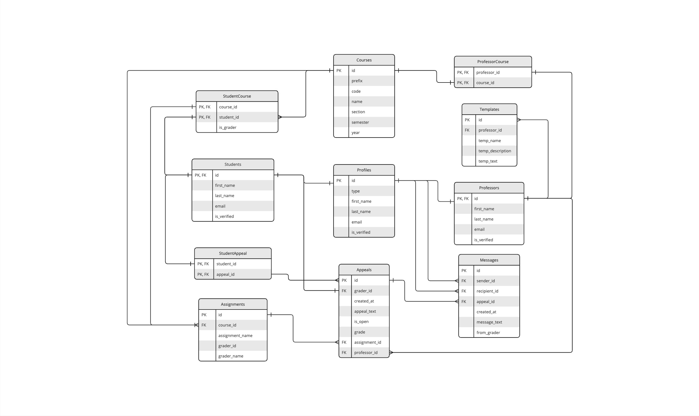
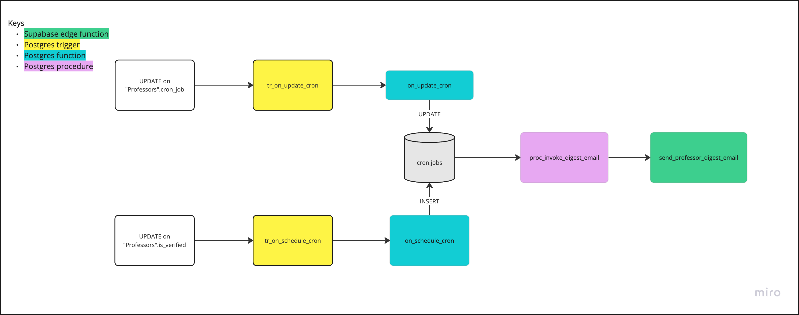
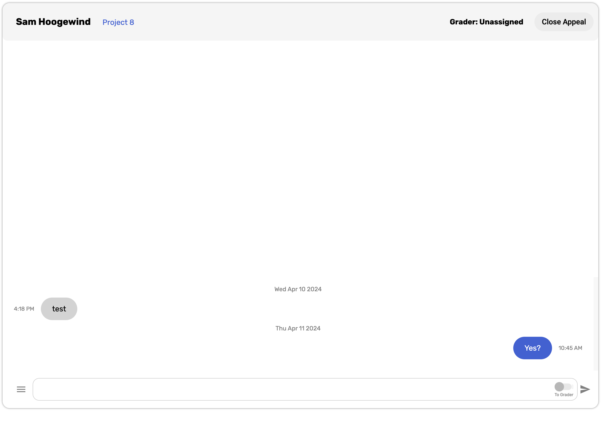
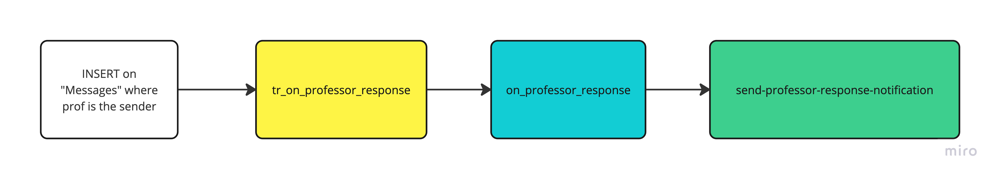
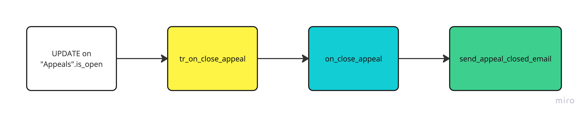

# Service

Thie repository contains our PostgreSQL queries and Supabase Edge Functions

- `supabase/migrations`: database migrations and SQL files
- `supabase/functions`: Supabase edge functions

# Links to Official Docs

- [Supabase local development with CLI](https://supabase.com/docs/guides/cli)
- [Supabase edge functions](https://supabase.com/docs/guides/functions)

# Configuring Local Development

## Prerequisite:

Supabase local development uses [Docker](https://docs.docker.com/get-docker/) to start and stop Supabase services. Make sure to have Docker running on your machine before continuing with the configuration.

Once you have Docker running, you can following the steps below to configure the local development environment. ([source](https://supabase.com/docs/guides/cli/getting-started#installing-the-supabase-cli))

## Setup

1. [Install Supabase CLI](https://supabase.com/docs/guides/cli/local-development)
2. Initialize the project
   ```
   supabase init
   ```
3. Start the Docker container
   ```
   supabase start
   ```
4. Stop the Docker containers when not utilizing it
   ```
   supabase stop
   ```

# Database Management

Although it is ideal to manage all database changes on one platform, during the process of figuring out Supabase, there were some aspects of our database that were created using the Supabase web console. Therefore, queries used to create tables, apply constraints, or apply RLS policies may not be found in this repository.

The SQL format of table definitions, RLS policies, and functions that are used, but not in this repository can be found in the web console. The only thing not available on the web console is the one `procedure` used in this project. The definition can be found in [this file](./supabase/migrations/20240402231554_call_edge_fn_professor.sql202404).

## TL;DR

> Supabase local developement was primarily used to write Postgres functions and procedures, not much table definitions and policies. What is not written in this repository can be found in the web console

## Database Schema



## Database Migration Files

supabase migration [docs](https://supabase.com/docs/reference/cli/supabase-migration)

Each `.sql` file is a migration file. This section includes information regarding the typical migration flow and on updating existing migration files.

### Typical workflow

1. Create a migration file

   Each migration file was generated using the command below

   ```
   supabase migration new <name>
   ```

2. Make changes to the file and save
3. Reset the local database
   ```
   supabase db reset
   ```
4. Push the changes

   Once changes are pushed, you will be able to see them on the web

   ```
   supabase db push
   ```

### Making changes to existing migration files

If a small change to a `.sql` file was made (e.g. adding 1 condition to a `SELECT` query), you can utilize an existing migration file to push your changes instead of having to create a new migration file.

Each migration file has a timestamp associated, as can be seen from the `.sql` file names. For example, `20240409001420_tr_on_professor_response.sql`. In this doc, the \<timestamp> will be referred to as the timestamp of the migration file names.

1. Revert the migration
   ```
   supabase migration repair <timestamp> --status reverted
   ```
2. Make changes
3. Reset the local database

   ```
   supabase db reset
   ```

   > Although this step is not necessary, it is good practice to do so, as it makes sure the local and remote databases are in sync.

4. Push the changes

   ```
   supabase db push --include-all
   ```

   > `--include-all` makes sure all the migrations are pushed to the remote database

# Edge Functions

## Helpful Links

- Supabase Edge Functions [Official Docs](https://supabase.com/docs/guides/functions)
- [Sending Emails with Resend](https://supabase.com/docs/guides/functions/examples/send-emails)

## Workflow

1. [Configure Local Development CLI](#configuring-local-development) and make sure [Docker](#prerequisite) is running
2. Create a function

   ```
   supabase functions new <name>
   ```

   This will create a directory under `supabase/functions`

3. Open up `index.ts` and write the function
4. Deploy the function

   ```
   supabase functions deploy <name>
   ```

   If you want to deploy all the functions, run

   ```
   supabase functions deploy
   ```

# Email Notifications

> TL;DR: Users get email notifications in the following cases:

- [Professor email digest](#professor-email-digest): The number of appeals they received over the past day/week/month depending on preferences
- [Student/Grader interaction history notification](#studentgrader-interaction-history-notification): Students and Graders receive email notifications when a Professor replies to their appeal in the interaction history
- [Student appeal notification](#student-appeal-notification): Students receive an email when the Professor closes their appeal

The Supabase edge functions sending the email notifications are defined under the [`supabase/functions`](supabase/functions) directory. The edge functions are invoked by the Postgres extension [`pg_net`](https://github.com/supabase/pg_net/), and the professor email digest emails are scheduled and configured using the [`pg_cron`](https://github.com/citusdata/pg_cron) extension.

## Tools

- `pg_net` enables async http/https requests in in postgreSQL.
- `pg_cron` enables users to schedule jobs based on a cron schedule inside the database.

For the email-notification service, we use a combination of `pg_net`, `pg_cron`, Postgres Triggers, and Supabase edge functions to send notification emails based on a cron schedule. Professor users are able to update their cron schedule through the settings page of their GradeBoost accounts, which will update the email schedule to the their preferences.

> It is also important to note that the procedure `proc_invoke_digest_email` can only be viewed and edited through the code in this repo. It is not available to view/edit on the Supabase web console.

## Additional Helpful Links

- [How to invoke a supabase edge function with pg_net](https://supabase.com/docs/guides/database/extensions/pg_net#invoke-a-supabase-edge-function)
- [How to use pg_net with a trigger](https://supabase.com/docs/guides/database/extensions/pg_net#execute-pgnet-in-a-trigger)
- [How to use pg_cron to run procedures](https://www.alibabacloud.com/help/en/analyticdb-for-postgresql/user-guide/use-the-pg-cron-extension-to-configure-scheduled-tasks)
- [Postgres docs on procedures](https://www.postgresql.org/docs/current/xproc.html)
- [Difference between procedures and functions in Postgres](https://www.red-gate.com/simple-talk/homepage/functions-and-procedures-learning-postgresql-with-grant/#:~:text=Functions%20return%20a%20result%20set,transactions%20where%20functions%20do%20not.)

## Professor Email Digest



### Case 1: New Professor verifies their email

- **Event**: `UPDATE` on the `PUBLIC."Professors".is_verified` column
- **Trigger**: [`UPDATE` trigger](./supabase/migrations/20240405204725_tr_on_schedule_cron.sql) that calls `cron.schedule()` to initiate cron schedule

`cron.schedule()` will add the email schedule to the table `cron.jobs` table in the `cron` schema. The default setting for email digests is 8:00 AM on every Monday.

### Case 2: Professor changes emailing CRON schedule

- **Event**: `UPDATE` on the `PUBLIC.Professors.cron_job` column
- **Trigger**: [`UPDATE` Trigger](./supabase/migrations/20240405205610_tr_on_update_cron.sql) that calls `cron.alter_job()` to change the cron job

## Student/Grader Interaction History Notification



Whenever a Professor sends a message through the interaction history to the Grader or the Student, they will get an email notification that a Professor has sent them a message.



- **Event**: `INSERT` on `PUBLIC.Messages` where `recipient_id` is the Student's ID and the `sender_id` is the Professor's ID
- **Trigger**: [`INSERT` Trigger](./supabase/migrations/20240409001420_tr_on_professor_response.sql) that calls [`on_professor_response`](./supabase/migrations/20240408234832_on_professor_response_fn.sql), that invokes [`send-professor-response-notification`](./supabase/functions/send-professor-response-notification/)

## Student Appeal Notification



Students will be notified via email if their appeals are closed by the Professor.

- **Event**: `UPDATE` on the `PUBLIC.Appeals.is_open` column
- **Trigger**: [`UPDATE` Trigger](./supabase/migrations/20240408225853_tr_on_close_appeal.sql) that calls [`on_close_appeal`](./supabase/migrations/20240408222110_on_close_appeal_fn.sql), that invokes [`send_appeal_closed_email`](./supabase/functions/send-appeal-closed-email/)
